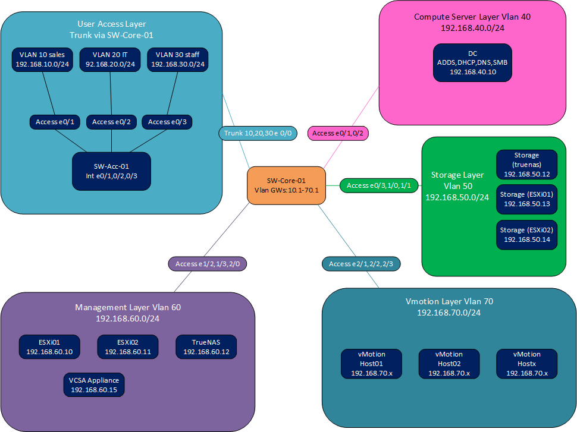
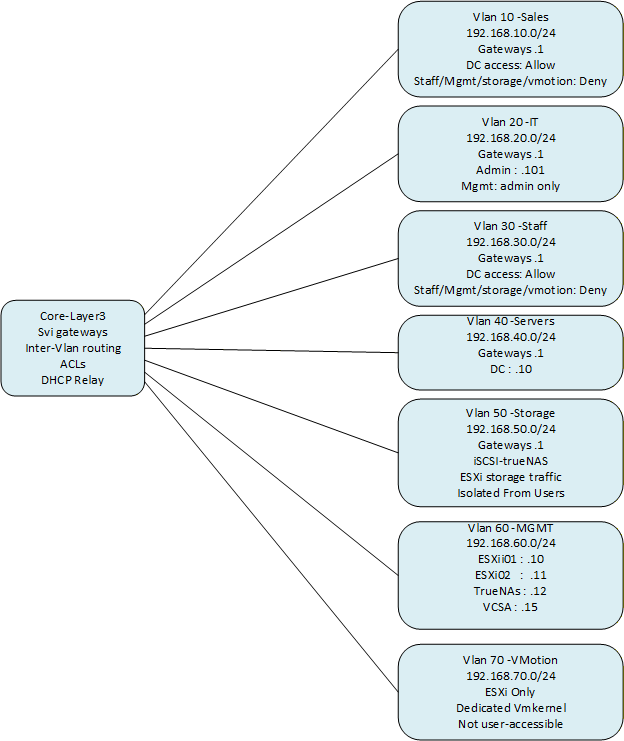

# Virtualized Small-Enterprise Data Center & Segmented Cisco Network

A personal educational lab project focused on virtualization, networking,
Windows Server infrastructure, storage, security, and troubleshooting.

## Overview

This project simulates a small-enterprise infrastructure environment using
nested VMware virtualization, Cisco L2/L3 networking, Windows Server,
Active Directory, shared iSCSI storage, and centralized management.

The lab was designed and implemented as a personal technical project to
practice infrastructure administration and validate networking and
virtualization concepts in a controlled environment.

> **Project status:** Personal educational lab.  
> This environment is not production infrastructure and has not been
> validated for production use.

## Architecture

The lab consists of:

- VMware Workstation 17
- 2 × VMware ESXi 6.7 hosts
- VMware vCenter Server Appliance (VCSA) 6.7
- TrueNAS SCALE with shared iSCSI storage
- Windows Server 2016
- EVE-NG 6.2 for Cisco network emulation
- Cisco L2/L3 network architecture

## Network Design

The network is segmented using seven VLANs:

| VLAN | Name | Purpose |
|------|------|---------|
| 10 | SALES | Sales clients |
| 20 | IT | IT users and administration |
| 30 | STAFF | Staff clients |
| 40 | SERVERS | Server infrastructure |
| 50 | STORAGE | iSCSI storage traffic |
| 60 | MANAGEMENT | ESXi, VCSA and TrueNAS management |
| 70 | VMOTION | vMotion traffic |

The Cisco core switch provides inter-VLAN routing and access control.

DHCP is centralized on Windows Server 2016, with DHCP relay configured
on the client VLANs.

## Windows Server & Active Directory

The Windows Server infrastructure includes:

- Active Directory Domain Services
- DNS
- DHCP
- File Server
- Organizational Units
- Role-based security groups
- GPOs
- NTFS and SMB permissions
- Department-based file shares
- Creator Owner permissions for the Public folder

The project follows an AGDLP-style permission model:

User → Global Group → Domain Local Group → Resource ACL

## Virtualization & Storage

The virtualization environment includes:

- Two nested ESXi 6.7 hosts
- VCSA 6.7
- Dedicated management networking
- Dedicated storage networking
- Dedicated vMotion networking
- TrueNAS shared iSCSI storage
- Shared VMFS datastore

The shared datastore was used to validate vCenter-managed workloads
and ESXi High Availability behavior.

## High Availability & vMotion

ESXi High Availability was tested using a host failure scenario.

The affected VMs were restarted on the surviving ESXi host using the
shared iSCSI datastore.

vMotion was also tested between the two ESXi hosts using a dedicated
VMkernel network.

## Security

The lab includes:

- Inter-VLAN ACLs
- Network segmentation
- Restricted management access
- SSH-based device management
- VTY source restrictions
- Role-based Active Directory permissions
- NTFS/SMB access control

Some additional hardening features are planned for a future phase.

## Troubleshooting & Engineering Lessons

An important part of the project was troubleshooting problems rather than
only following a successful deployment path.

During development, the Cisco network emulation layer initially used GNS3.
Instability was observed with the IOSv/E1000 path, including CPU and packet
loss behavior.

The network emulation layer was subsequently migrated to EVE-NG, while
retaining the same logical network design.

The lab also included troubleshooting of:

- iSCSI connectivity and datastore creation
- Virtual networking paths
- ACL return traffic
- Windows host routing
- Virtual NIC behavior
- Network throughput
- Packet-level connectivity

Wireshark, ICMP, TCP/445 and iperf3 were used during troubleshooting and
validation.

## Validation

The following areas were validated in the lab:

- DHCP relay
- Inter-VLAN connectivity
- ACL restrictions
- Active Directory access
- SMB/file permissions
- iSCSI datastore visibility
- VCSA management of both ESXi hosts
- ESXi HA recovery
- vMotion
- Network connectivity and troubleshooting scenarios

## Documentation

Detailed technical documentation is available in:

`documentation/project-documentation.pdf`

The documentation contains the architecture, implementation steps,
configuration details, validation results, troubleshooting process,
and engineering lessons learned.

## Project Scope

This project represents personal hands-on lab work and should not be
considered professional production experience.

The Internet edge firewall and remote-access VPN are planned as a future
phase and are not presented as completed functionality.
